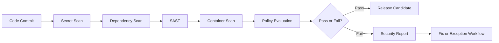

```mermaid
flowchart LR
    A[Code Commit] --> B[Secret Scan]
    B --> C[Dependency Scan]
    C --> D[SAST]
    D --> E[Container Scan]
    E --> F[Policy Evaluation]
    F --> G{Pass or Fail?}
    G -->|Pass| H[Release Candidate]
    G -->|Fail| I[Security Report]
    I --> J[Fix or Exception Workflow]
```